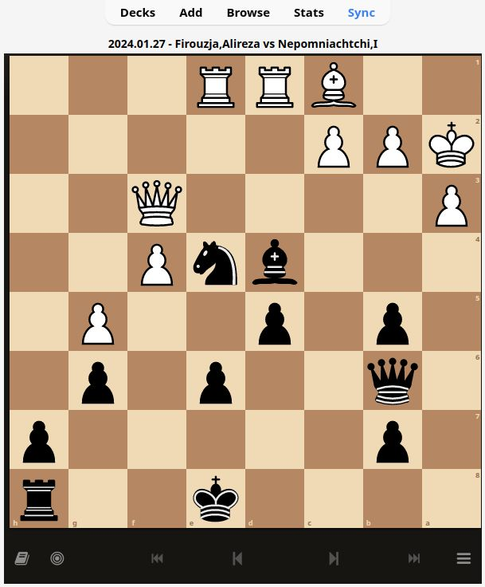
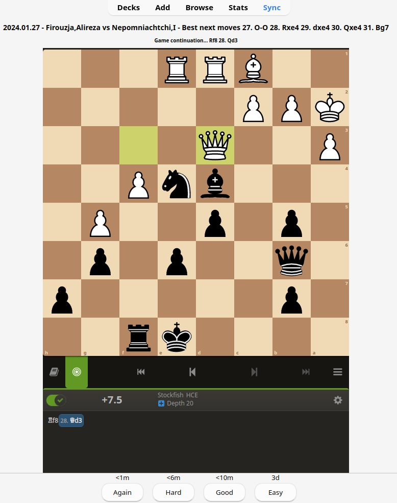

# Chess Blunder Analyzer and Anki Card Generator

This command line tool analyzes chess games in PGN format, identifies blunders based on a specified threshold, and generates Anki flashcards for the identified blunders. The generated flashcards include the board position, the game continuation, and the best next moves suggested by a chess engine.

## Features

- Reads chess games from a PGN file
- Analyzes games using a specified chess engine (default: Stockfish)
- Identifies blunders based on a configurable threshold (default: 200 centipawns)
- Filters blunders based on player perspective (white, black, winner, loser) or specific player name
- Generates Anki flashcards with the blunder position, game continuation, and best next moves
- Customizable Anki card template with CSS styling
- Outputs the generated Anki deck as an .apkg file

## Cards




## Requirements

- Python 3.x
- chess library
- genanki library
- A compatible chess engine (default: Stockfish)
- PGN file containg chess games (you could fet it from your games in lichess)

## Usage

```bash
python chess_blunder_analyzer.py [--engine ENGINE_PATH] [--pgn PGN_FILE] [--player PLAYER_FILTER] [--output OUTPUT_FILE] [--blunder_threshold THRESHOLD] [--engine_time ENGINE_TIME]  [--deck_name DECK_NAME]    

    --engine: Path to the chess engine executable (default: /usr/games/stockfish)
    --pgn: Path to the PGN file containing the chess games (default: sample.pgn)
    --player: Player filter - white, black, winner, loser, or a specific player name (default: white/black)
    --output: Output file name for the generated Anki deck (default: anki_deck_<random_id>.apkg)
    --blunder_threshold: Threshold (in centipawns) for a move to be considered a blunder (default: 200)
    --engine_time: Time in seconds for the engine to analyze each move. Default is 0.2 seconds.
    --deck_name: Name of the Anki deck
```

## Example

```bash
python chess_blunder_anki.py --engine /path/to/stockfish --pgn games.pgn --player winner --output my_anki_deck.apkg --blunder_threshold 300
```

This command will analyze the games in games.pgn using the Stockfish engine, identify blunders made by the winning player with a threshold of 300 centipawns, and generate an Anki deck named my_anki_deck.apkg.
Anki Card Template

The generated Anki cards include the following fields:

- PuzzleID: A unique identifier for the blunder position
- PGN: The PGN representation of the blunder position
- PGNContinuation: The game continuation that occurs after the blunder
- Moves: The best next moves suggested by the chess engine
- Various metadata fields (player names, result, date, site, event, ratings, etc.)

The card template includes an embedded chess board viewer using the Lichess analysis board.
License

### Install stockfish

Here are the steps to install Stockfish using the package manager in Debian based systems:

1) Open a terminal window.

2) Update the package list by running the following command:

```bash
sudo apt update
```

3) Install Stockfish by running the following command:

```bash
sudo apt install stockfish
```

This command will download and install the Stockfish package from the official repositories.

Once the installation is complete, you can verify the installation by running the following command:

```bash
stockfish --version
```

This should display the version information of the installed Stockfish engine.

## License

This project is licensed under the MIT License.